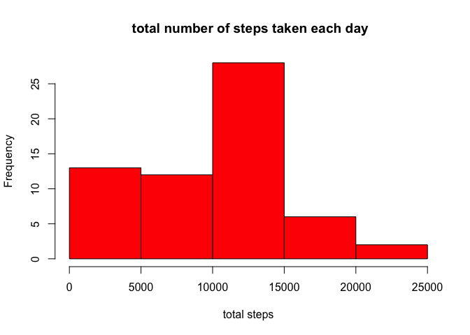
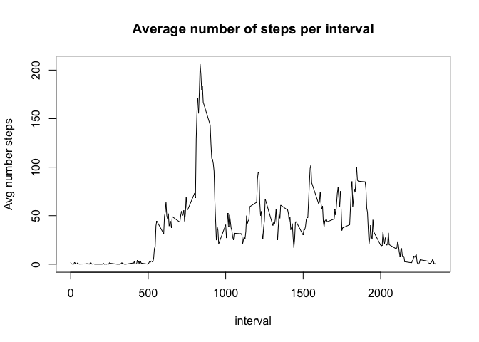
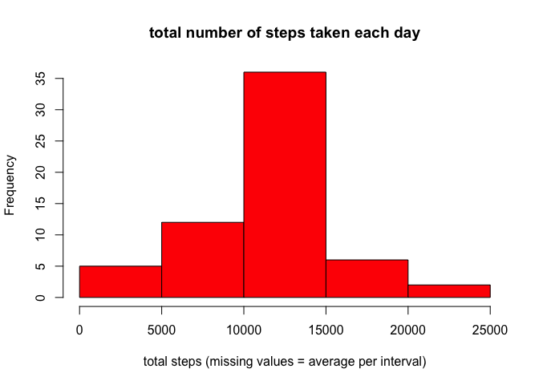
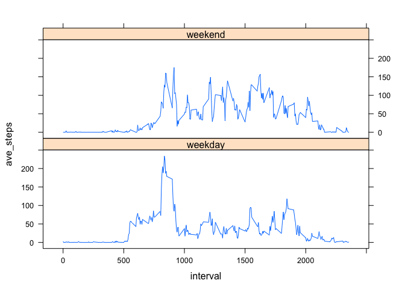

# Reproducible Research: Peer Assessment 1


## Loading and preprocessing the data

```r
unzip("activity.zip")
data<-read.csv("activity.csv")
data$date<-as.Date(data$date,"%Y-%m-%d")
```
load packages

```r
library(dplyr)
library(lattice)
```

```
## Warning: package 'lattice' was built under R version 3.1.3
```
## What is mean total number of steps taken per day?

1. Calculate the total number of steps taken per day

```r
totalSteps <- data %>% group_by(date) %>% summarise(total_steps = sum(steps,na.rm=TRUE))
totalSteps
```

```
## Source: local data frame [61 x 2]
## 
##          date total_steps
## 1  2012-10-01           0
## 2  2012-10-02         126
## 3  2012-10-03       11352
## 4  2012-10-04       12116
## 5  2012-10-05       13294
## 6  2012-10-06       15420
## 7  2012-10-07       11015
## 8  2012-10-08           0
## 9  2012-10-09       12811
## 10 2012-10-10        9900
## ..        ...         ...
```

2. Make a histogram of the total number of steps taken each day


```r
hist(totalSteps$total_steps, main = " total number of steps taken each day",xlab = "total steps",col="red")
```

 

 3. Calculate and report the mean and median of the total number of steps taken per day


```r
meanSteps<-mean(totalSteps$total_steps)
medianSteps<-median(totalSteps$total_steps)
```

Mean is 9354.2295082
Median is 10395

## What is the average daily activity pattern?

1. Make a time series plot (i.e. type = "l") of the 5-minute interval (x-axis) and the average number of steps taken, averaged across all days (y-axis)

 

2. Which 5-minute interval, on average across all the days in the dataset, contains the maximum number of steps?


```r
maxIntl<-aveSteps%>%filter(ave_steps==max(aveSteps$ave_steps))%>%select(interval)
```

The 5-min interval than contains the maximum number of steps on average for all day is 835

## Imputing missing values

1. Calculate and report the total number of missing values in the dataset (i.e. the total number of rows with NAs)

```r
NAS<-sum(is.na(data$steps))
```
the number of NAs is 2304

2. Devise a strategy for filling in all of the missing values in the dataset. The strategy does not need to be sophisticated. For example, you could use the mean/median for that day, or the mean for that 5-minute interval, etc.

Loop that matches every interval in dataset with second dataset presenting the values for replacing. Taken from [Conditional merge/replacement in R](http://stackoverflow.com/questions/6112260/conditional-merge-replacement-in-r)


3. Create a new dataset that is equal to the original dataset but with the missing data filled in.


```r
data2<-data
for(id in 1:nrow(aveSteps)){
  data2$steps[data2$interval %in% aveSteps$interval[id] & is.na(data2$steps)] <- aveSteps$ave_steps[id]
}
head(data2)
```

```
##       steps       date interval
## 1 1.7169811 2012-10-01        0
## 2 0.3396226 2012-10-01        5
## 3 0.1320755 2012-10-01       10
## 4 0.1509434 2012-10-01       15
## 5 0.0754717 2012-10-01       20
## 6 2.0943396 2012-10-01       25
```

4. Make a histogram of the total number of steps taken each day and Calculate and report the mean and median total number of steps taken per day. Do these values differ from the estimates from the first part of the assignment? What is the impact of imputing missing data on the estimates of the total daily number of steps?


```r
totalSteps2 <- data2 %>% group_by(date) %>% summarise(total_steps = sum(steps,na.rm=TRUE))
hist(totalSteps2$total_steps, main = " total number of steps taken each day ",xlab = "total steps (missing values = average per interval)",col="red")
```

 

```r
meanSteps2<-mean(totalSteps2$total_steps)
medianSteps2<-median(totalSteps2$total_steps)
```

- Original mean is 9354.2295082, new mean is 1.0766189\times 10^{4}
- Original median is 10395, new median is 1.0766189\times 10^{4}

## Are there differences in activity patterns between weekdays and weekends?

1. Create a new factor variable in the dataset with two levels – “weekday” and “weekend” indicating whether a given date is a weekday or weekend day.

```r
data3<-data %>% mutate(day=as.character(weekdays(date)))
data3$day[data3$day %in% c("Saturday","Sunday")] <- "weekend"
data3$day[data3$day != "weekend"]<- "weekday"
```
2. Make a panel plot containing a time series plot (i.e. type = "l") of the 5-minute interval (x-axis) and the average number of steps taken, averaged across all weekday days or weekend days (y-axis). See the README file in the GitHub repository to see an example of what this plot should look like using simulated data.

```r
aveStepsDay <-data3%>% group_by(interval,day) %>% summarise(ave_steps = mean(steps,na.rm=TRUE))
xyplot(ave_steps~interval|day,aveStepsDay, type="l",layout = c(1, 2))
```

 
